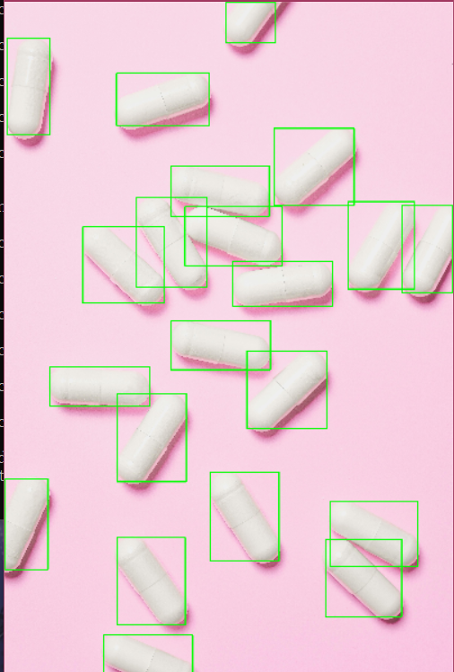

# HSV Counting

一个基于 OpenCV 与 HSV 颜色分割的目标计数实验项目。

这个分支是项目的**稳定基线版本**，主要面向颜色特征较明显、背景相对简单、目标数量适中的规则目标图像。当前实现重点在于：通过 HSV 阈值分割提取目标区域，再结合轮廓筛选完成目标计数与结果标注。

## Branch Position

`stable/HSV-counting` 用于保存项目中第一个**能够稳定跑通的特化方案**。  
它不是追求通用性的最终版本，而是后续鲁棒性优化、分水岭分离、复杂场景实验的对照基线。

## Proccess

整体处理流程如下：

1. 读取原图
2. 转换到 HSV 空间
3. 根据目标颜色范围进行阈值分割
4. 通过形态学操作去噪、修补区域
5. 提取外轮廓
6. 根据面积等规则过滤无效轮廓
7. 在原图上绘制检测结果并输出计数

## Demo

### Input

### Output

## Features

- 基于 HSV 的目标分割
- 轮廓提取与基础筛选
- 目标数量统计
- 结果可视化标注
- 适合作为后续版本的 baseline

## Applicable Scenarios

该版本更适合以下图像条件：

- 背景较干净
- 目标颜色与背景存在可区分差异
- 光照变化不大
- 目标之间大多没有严重粘连

## Limitations

当前版本仍然存在明显局限：

- 对光照变化较敏感
- 对颜色分布差异大的图片泛化能力较弱
- 对复杂背景适应性有限
- 遇到粘连目标时容易出现欠分割
- 不同类型图片往往仍需重新调参

## Project Structure

- `ObjectCounting/`：项目源码
- `assets/input/`：输入图像
- `assets/output/`：输出结果
- `assets/demo/`：README 演示图
- `docs/`：开发笔记

## Meaning of This Branch

这个分支的意义不在于“完全通用”，而在于：

- 证明我已经跑通了一条完整的传统视觉计数流程
- 沉淀出一个可复现、可展示、可继续迭代的基线版本
- 为后续鲁棒性改进提供对照参考

## Future Work

下一步可能继续尝试：

- 提高对不同图像类型的适应能力
- 引入更稳健的预处理与筛选规则
- 处理粘连目标分离问题
- 对比 HSV、灰度二值化、分水岭等不同路线的效果